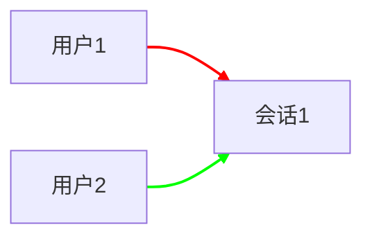

## 该.md文档主要详细解释项目中比较关键的几个技术的逻辑和实现，其余功能可参考项目代码
>主要有：`会话管理`、`消息实时推送`、`消息转存`
---

### 1、会话管理模块
#### 数据库设计

使用数据库来保存会话
> 会话和用户之间是 `多对多` 的关系
比如`会话1` sessionId = 1，该会话有两个用户 userId = 1，userId = 2，要实现这两个用户的聊天功能，只需要 `用户1` 和 `用户2` 分别向 `会话1` 发送消息；
通过获取登陆后创建的会话 `session`，可设置每条消息在对方聊天窗的显示方式


> 通过这种模式，可为后续实现 `群聊` 做铺垫，即 `一个会话`中存在`多个用户`就可以实现

#### 获取会话列表
约定 HTTP 接口
**请求**
```java
GET /sessionList HTTP/1.1
```
**响应**
* 这里的 `friends` 使用的是 `数组` ，表示`多个用户`，主要是为了后续的`群聊` 功能做铺垫
* lastMessage 表示该会话中的最后一条消息，主要是为了在会话列表中进行预览展示
```java
HTTP/1.1 200 OK
Content-Type: application/json
[
    {
        sessionId: 1, 
        friends: [ 
                { 
                    friendName: 'lisi', 
                    friendId: 2, 
                } 
                ],
                lastMessage: '[2条] 晚上吃啥', 
    }, 
    {
        sessionId: 2, 
        friends: [ 
                { 
                    friendName: 'wangwu',
                    friendId: 3,
                }
    ],
                lastMessage: '[2条] 晚上吃啥', 
    }
]
```

**实现客户端代码**
> 如果 session.lastMessage == null，则设为''
**根据后端返回的`数组`，进行前端的元素拼接处理**
```java
/////////////////////////////////////////////////
// 获取登录用户的 会话列表
/////////////////////////////////////////////////
function getSessionList() {
    $.ajax({
        type: 'get',
        url: 'sessionList',
        success: function(body){
            // 1. 先清空 之前的会话列表
            let sessionListUL = document.querySelector('#session-list');
            sessionListUL.innerHTML = '';
            // 2. 遍历相应的数量，针对结果构造页面
            for(let session of body){
                // 针对 lastMessage 长度进行截断处理
                if(session.lastMessage.length > 10){
                    session.lastMessage = session.lastMessage.substring(0,10)+'...';
                }
                let li = document.createElement('li');
                // 把会话id 保存到 li 标签的自定义属性中
                li.setAttribute('message-session-id',session.sessionId);
                li.innerHTML = '<h3>'+ session.friends[0].friendName + '</h3>' 
                                     + '<p>' + session.lastMessage + '</p>';
                sessionListUL.appendChild(li);

                // 给 li 标签新增点击事件
                li.onclick = function(){
                    // 此处对应的 clickSession 函数的参数可以保证是点击的 li 标签
                    clickSession(li);
                }

                // 添加右键菜单事件
                li.oncontextmenu = function(e) {
                    e.preventDefault();
                    if(confirm("是否删除该会话？")) {
                        $.ajax({
                            type: 'post',
                            url: 'deleteSession?sessionId=' + session.sessionId,
                            success: function(body) {
                                alert("删除会话成功！");
                                getSessionList();
                            },
                            error: function() {
                                alert("删除会话失败！");
                            }
                        });
                    }
                };
            }
        }
    });
}
getSessionList();

/////////////////////////////////////////////////
// 点击 会话
/////////////////////////////////////////////////
function clickSession(currentLi){
    // 1. 设置 高亮
    let allLis = document.querySelectorAll('#session-list>li');
    activeSession(allLis,currentLi);
    // 2. 获取指定会话的历史消息 TODO
    let sessionId = currentLi.getAttribute("message-session-id");
    getHistoryMessage(sessionId);
}

function activeSession(allLis,currentLi){
    // 这里的 for 循环更主要的目的是取消未被选中的 li 的className
    for(let li of allLis){
        if(li == currentLi){
            li.className = 'selected';
        }else{
            li.className = '';
        }
    }
}

```

**后端代码**
1. 创建实体类 `MessageSession` 
```java
package com.hfy.chat_room.model;

import java.util.List;
// 这个类表示一个会话
public class MessageSession {
    private int sessionId;
    private List<Friend> friends;
    private String lastMessage;
}
```
2.创建 `MessageSessionMapper` 接口
```java
package com.hfy.chat_room.model;

import org.apache.ibatis.annotations.Mapper;
import org.apache.ibatis.annotations.Param;
import java.util.List;
@Mapper
public interface MessageSessionMapper {
    // 1. 根据 userId 获取到该用户都在哪些会话中存在 ，返回结果是一组 sessionId
    List<Integer> getSessionIdsByUserId(int userId);

    // 2. 根据 sessionId 再来查询这个会话都包含了哪些用户(刨除最初的自己)
    List<Friend> getFriendsBySessionId(int sessionId,int selfUserId);

    // 3. 新增一个会话记录 ，返回会话的 id
    // 这样的方法返回值 int 表示的是插入操作影响到几行, 此处获取sessionId 是通过参数的 messageSession 的 sessionId 属性获取的
    int addMessageSession(MessageSession messageSession);

    // 4. 给 message_session_user 表页新增对应的记录
    void addMessageSessionUser(MessageSessionUserItem messageSessionUserItem);
}
```
3. 创建 `MessageSessionMapper.xml`
* 需要按照会话的最后访问时间降序排序
* 实现按时间排序效果，需要嵌套上一层子查询

```java
<?xml version="1.0" encoding="UTF-8"?>
<!DOCTYPE mapper PUBLIC "-//mybatis.org//DTD Mapper 3.0//EN" "http://mybatis.org/dtd/mybatis-3-mapper.dtd">
<mapper namespace="com.hfy.chat_room.model.MessageSessionMapper">
    <select id="getSessionIdsByUserId" resultType="java.lang.Integer">
        select sessionId from message_session
        where sessionId in
        (select sessionId from message_session_user where userId = #{userId})
        order by lastTime desc
    </select>

    <select id="getFriendsBySessionId" resultType="com.hfy.chat_room.model.Friend">
        select userId as friendId, username as friendName from user
        where userId in
        (select userId from message_session_user where sessionId = #{sessionId} and userId != #{selfUserId})
    </select>

    <insert id="addMessageSession" useGeneratedKeys="true" keyProperty="sessionId">
        insert into message_session values(null,now());
    </insert>

    <insert id="addMessageSessionUser">
        insert into message_session_user values(#{sessionId}, #{userId})
    </insert>
</mapper>
```

4. 创建 `MessageSessionAPI` 
```java
package com.hfy.chat_room.Controller;

import com.alibaba.fastjson.JSONObject;
import com.hfy.chat_room.model.*;
import jakarta.annotation.Resource;
import jakarta.servlet.http.HttpServletRequest;
import jakarta.servlet.http.HttpSession;
import org.springframework.transaction.annotation.Transactional;
import org.springframework.web.bind.annotation.*;

import java.util.ArrayList;
import java.util.HashMap;
import java.util.List;

@RestController
public class MessageSessionAPI {
    @Resource
    private MessageSessionMapper messageSessionMapper;

    @Resource
    private MessageMapper messageMapper;
////////////////////////////////////////////////////////////////////////////////////
// 获取登录用户的 会话列表
////////////////////////////////////////////////////////////////////////////////////
    @GetMapping("/sessionList")
    @ResponseBody
    public Object getMessageSessionList(HttpServletRequest req){
        List<MessageSession> messageSessionList = new ArrayList<>();
        // 1. 获取当前用户的 userId (从 spring 的 session 中获取)
        HttpSession session = req.getSession(false);
        if(session == null){
            System.out.println("[getMessageSessionList] session == null");
            return messageSessionList;
        }
        User user = (User)session.getAttribute("user");
        if(user == null){
            System.out.println("[getMessageSessionList] user == null]");
            return messageSessionList;
        }
        // 2. 根据 userId 查询数据库，查出来有哪些会话 id
        List<Integer> sessionIdList = messageSessionMapper.getSessionIdsByUserId(user.getUserId());
        for(int sessionId : sessionIdList){
            MessageSession messageSession = new MessageSession();
            messageSession.setSessionId(sessionId);
            // 3. 遍历 会话id ，查询出每个会话里涉及到的好友都有谁
            List<Friend> friends = messageSessionMapper.getFriendsBySessionId(sessionId, user.getUserId());
            messageSession.setFriends(friends);
            // 4. 遍历会话id , 查询出每个会话的最后一条消息
            String lastMessage = messageMapper.getLastMessageBySessionId(sessionId);
            if(lastMessage == null){
                messageSession.setLastMessage("");
            }else{
                messageSession.setLastMessage(lastMessage);
            }
            messageSessionList.add(messageSession);
        }
        // 最终目标就是构造出一个 MessageSession 对象数组
        return messageSessionList;
    }
}
```

#### 创建会话
当用户点击好友列表中的好友时，实现`创建会话` 的操作

##### 前后端交互接口
**请求**
```java
POST /session?toUserId=1 HTTP/1.1
```
**请求**
```java
HTTP/1.1 200 OK
Content-Type: application/json;
{
    sessionId: 1,
}
```
##### 实现客户端代码
* 如果当前会话不存在，则会访问服务器，给服务器创建一个新会话。
* 把拿到的`会话id` ，保存到对应的 `会话li`标签的自定义属性中
给friendList中的每个li加上点击事件处理
```java
/////////////////////////////////////////////////
// 获取登录用户的好友列表
/////////////////////////////////////////////////
function getFriendList(){
    $.ajax({
        type:'get',
        url:'friendList',
        success:function(body){
            // 1.先把之前的好友列表内容清空
            let friendListUL = document.querySelector('#friend-list');
            friendListUL.innerHTML = '';
            // 2.遍历body， 把服务器相应的结果，加回到当前的 friend-list 中
            for(let friend of body){
                let li = document.createElement('li');
                li.innerHTML = '<h4>' + friend.friendName + '</h4>';
                // 此处把 friendId 页记录以备后用
                // 此处把 friendId 作为 html 的自定义属性，加到 li 标签上就行了
                li.setAttribute('friend-id', friend.friendId);
                friendListUL.appendChild(li);

                // 每个 li 标签，对应界面上的一个好友的选项，给 li 加上点击事件 的处理
                li.onclick = function() {
                    // 参数表示区分了当前用户点击的是哪个好友
                    clickFriend(friend);
                },
        error: function(){
            console.log('获取好友列表失败');
        }
    });
}
getFriendList();
```
**实现 clickFriend**
* 在会话列表中查找匹配的会话
* 如果找到了就放到最前面并`点击`
* 如果没找到，则创建会话(通知服务器)
* 自动切换到会话列表

```java
/////////////////////////////////////////////////
// 点击好友列表项触发的函数
/////////////////////////////////////////////////
function clickFriend(friend){
    // 1.先判定一下当前这个好友是否有对应的会话
    // 使用 用户的名字 friendName 来查找会话列表里是否有与该用户的会话，有就返回会话列表里的 li 没有就返回 null
    let sessionLi = findSessionByName(friend.friendName);
    let sessionListUL = document.querySelector('#session-list');
    if(sessionLi){
        // 2.如果存在匹配的结果，就把这个会话设置成选中状态，并且置顶
        // 使用 insertBefore 把这个找到的 li 标签放到 最前面
        sessionListUL.insertBefore(sessionLi,sessionListUL.children[0]);
        // 设置选中的 会话 高亮
        clickSession(sessionLi);
        // 因为该会话已经存在于 会话列表中，所有 onclick() 也已经设置过了，可以模拟点击
        //sessionLi.click();
    }else{
        // 3.如果不存在匹配的结果，就创建一个新会话(创建 li 标签 + 通知服务器)
        sessionLi = document.createElement('li');
        // 新会话 没有 lastMessage ，<p> 标签为空
        sessionLi.innerHTML = '<h3>' + friend.friendName + '</h3>'+'<p></p>';
        // 把 标签置顶
        sessionListUL.insertBefore(sessionLi, sessionListUL.children[0]);
        sessionLi.onclick = function(){
            clickSession(sessionLi);
        }
        sessionLi.click();
        // 发送消息给服务器，告诉服务器当前新建的会话是啥样的
        createSession(friend.friendId,sessionLi);
    }
    // 4.还需要把标签页给切换到 会话列表
    // 实现方式，只要找到会话列表标签页按钮，模拟一个点击操作
    let tabSession = document.querySelector('.tab .tab-session');
    tabSession.click();
}

function findSessionByName(username){
    // 先获取到会话列表中所有的 li 标签
    // 然后 依次遍历，看看这些 li 标签 谁的名字和 要查找的名字一致 
    let sessionLis = document.querySelectorAll('#session-list>li');
    for(let sessionLi of sessionLis){
        // 获取到该标签里的 h3 标签，进一步得到名字
        let h3 = sessionLi.querySelector('h3');
        if(h3.innerHTML == username){
            return sessionLi;
        }
    }
    return null;
}

// friendId 是构造 HTTP 请求时必备的信息
function createSession(friendId,sessionLi){
    $.ajax({
        type: 'post',
        url: 'session?toUserId='+ friendId,
        success: function(body){
            console.log("会话创建成功 sessionId = "+body.sessionId);
            sessionLi.setAttribute('message-session-id',body.sessionId);
        },
        error: function(){
            console.log("会话创建失败！");
        }
    });
}
```

##### 实现服务器代码
1. 创建 `MessageSessionUserItem` 实体类
> 其实也可以使用 `JSONObject` 创造返回数据，为了可读性更强，还是特定创建了一个`实体类`
```java
package com.hfy.chat_room.model;

// 使用这个类的对象来表示 message_session_user 表里的一个记录
public class MessageSessionUserItem {
    private int sessionId;
    private int userId;
}
```
2. 修改 `MessageSessionMapper` 接口，加入新方法
```java
    // 3. 新增一个会话记录 ，返回会话的 id
    // 这样的方法返回值 int 表示的是插入操作影响到几行, 此处获取sessionId 是通过参数的 messageSession 的 sessionId 属性获取的
    int addMessageSession(MessageSession messageSession);

    // 4. 给 message_session_user 表页新增对应的记录
    void addMessageSessionUser(MessageSessionUserItem messageSessionUserItem);
```
3. 实现 `MessageSessionMapper.xml`
```java
<insert id="addMessageSession" useGeneratedKeys="true" keyProperty="sessionId">
        insert into message_session values(null,now());
    </insert>

    <insert id="addMessageSessionUser">
        insert into message_session_user values(#{sessionId}, #{userId})
    </insert>
```
4. 修改 `MessageSesisonAPI` ，加入新方法 `addMessageSession`
> 这里的**数据操作**需要使用 `事务`,给相关方法加上 `@Transactional` 注解，统一数据的变化
```java
////////////////////////////////////////////////////////////////////////////////////
// 创建  会话
////////////////////////////////////////////////////////////////////////////////////
    @PostMapping("/session")
    @ResponseBody
    @Transactional
    public Object addMessageSession(int toUserId, @SessionAttribute("user") User user){
        HashMap<String,Integer> resp = new HashMap<>();
        // 进行数据库的插入操作
        // 1. 先给 Message_session 表里插入记录,使用这个参数的目的主要是为了获取到会话的 sessionId
        // 换而言之 MessageSession 里的 friends 和 lastMessage 属性此处用不上
        MessageSession messageSession = new MessageSession();
        messageSessionMapper.addMessageSession(messageSession);
        // 2. 给 message_session_user 表插入记录
        MessageSessionUserItem item1 = new MessageSessionUserItem();
        item1.setSessionId(messageSession.getSessionId());
        item1.setUserId(user.getUserId());
        messageSessionMapper.addMessageSessionUser(item1);

        // 3. 给 message_session_user 表插入另一个用户的记录
        MessageSessionUserItem item2 = new MessageSessionUserItem();
        item2.setSessionId(messageSession.getSessionId());
        item2.setUserId(toUserId);
        messageSessionMapper.addMessageSessionUser(item2);

        System.out.println("[addMessageSession] 新建会话成功！ sessionId = "+messageSession.getSessionId()+",userId1 = "+user.getUserId()+",userId2 = "+toUserId);

        resp.put("sessionId", messageSession.getSessionId());
        return resp;
    }
```

#### 消息传输模块
##### 数据库设计
```java
-- 创建消息表
drop table if exists message;
create table message(
    messageId int primary key auto_increment,
    fromId int, -- 消息是哪个用户发来的
    sessionId int, -- 消息属于哪个会话
    content varchar(2048), -- 消息正文
    postTime datetime -- 消息发送时间
);

-- 构造几个测试数据 张三和李四
insert into message values(1,1,1,'今晚吃啥','2000-05-01 00:00:00');
insert into message values(2,2,1,'随便','2000-05-01 17:01:00');
insert into message values(3,1,1,'那吃面？','2000-05-01 17:02:00');
insert into message values(4,2,1,'不想吃？','2000-05-01 17:03:00');
insert into message values(5,1,1,'那你想吃啥？','2000-05-01 17:04:00');
insert into message values(6,2,1,'随便','2000-05-01 17:05:00');

insert into message values (11, 1, 1, '那吃米饭炒菜?', '2000-05-01 17:06:00');
insert into message values (8, 2, 1, '不想吃', '2000-05-01 17:07:00');
insert into message values (9, 1, 1, '那你想吃啥?', '2000-05-01 17:08:00');
insert into message values (10, 2, 1, '随便', '2000-05-01 17:09:00');
```
> **仅供测试专用**
##### 获取历史消息列表
> 当用户选中某个会话的时候，触发这个行为，这里要对前面的选中会话操作进行补充实现

**约定前后端交互接口**
**请求**
```java
GET /message?sessionId=1
```
**响应**
```java
HTTP/1.1 200 OK
Content-Type:application/json
[
    {
        messageId: 1, 
        fromId: 1, 
        fromName: 'zhangsan', 
        sessionId: 1, 
        content: '今晚吃啥?',
        postTime: '2000-01-01 20:00:00', 
    },
    {
        messageId: 2, 
        fromId: 2, 
        fromName: 'lisi', 
        sessionId: 1,
        content: '随便',
        postTime: '2000-01-01 20:02:00',
    }
]
```
##### 实现服务器代码
1. 创建实体类 `Message`
```java
package com.hfy.chat_room.model;

public class Message {
    private int messageId;
    private int fromId;
    private String fromName;
    private int sessionId;
    private String content;
}
```
2. 创建 `MessageMapper` 接口
```java
List<Message> getMessagesBySessionId(int sessionId);
```
3. 实现 `MessageMapper.xml`
* 为了拿到用户名，需要进行一个联合查询
```java
<select id="getMessagesBySessionId" resultType="com.hfy.chat_room.model.Message">
        select messageId,fromId,username as fromName ,sessionId,content
        from user,message
        where user.userId = message.fromId and message.sessionId = #{sessionId}
        order by postTime desc limit 100
    </select>
```
4. 创建 `MessageAPI` 类
```java
package com.hfy.chat_room.Controller;

import com.hfy.chat_room.model.Message;
import com.hfy.chat_room.model.MessageMapper;
import jakarta.annotation.Resource;
import org.springframework.web.bind.annotation.GetMapping;
import org.springframework.web.bind.annotation.RestController;
import java.util.Collection;
import java.util.Collections;
import java.util.List;

@RestController
public class MessageAPI {
    @Resource
    private MessageMapper messageMapper;

    @GetMapping("/message")
    public Object getMessage(int sessionId){
        List<Message> messages = messageMapper.getMessagesBySessionId(sessionId);
        // 数据库中根据逆序筛选了最近100条消息，传回前端时要进行升序排列才是有逻辑的真实消息记录
        Collections.reverse(messages);
        return messages;
    }
}
```
##### 实现客户端代码 getHistoryMessage() 方法
* 会话窗口的标题：设置成当前被选中的会话的h3里的内容
* 会话窗口的内容：从服务器拿到的消息数据
```java
// 获取指定会话的历史消息
function getHistoryMessage(sessionId){
    console.log("获取历史消息 sessionId="+sessionId);
    //1. 先清空右侧消息列表已有内容
    let titleDiv = document.querySelector('.right .title');
    titleDiv.innerHTML = '';
    let messageShowDiv = document.querySelector('.right .message-show');
    messageShowDiv.innerHTML = '';

    //2. 重新设置会话标题，就是点击会话时的那个标题，先找到当前选中的会话是谁
    // 之前设置了那个会话备选中，就会加上一个类名 selected 
    let selectedH3 = document.querySelector('#session-list .selected>h3');
    if(selectedH3){
        // selecteH3 可能不存在，比如页面加载 阶段，可能没有那个会话被选中
        // 也就没有 会话带有 selected 标签，此时就无法查询出这个 selecteH3
        titleDiv.innerHTML = selectedH3.innerHTML;
    }

    // 发送一个 ajax 请求，获取该会话的历史消息
    $.ajax({
        type: 'get',
        url: 'message?sessionId='+ sessionId,
        success: function(body){
            // 此处返回的 body 是个 js 对象数组，里面的每个元素都是一条消息
            // 直接遍历
            for(let message of body){
                addMessage(messageShowDiv,message);
            }
            // 滚动条自动到最下方
            scrollBottom(messageShowDiv);
        }
    });
}

function addMessage(messageShowDiv,message){
    let messageDiv = document.createElement('div');
    // 此处需要针对当前消息是不是用户自己发的，决定靠左靠右
    let selfUsername = document.querySelector('.left .user').innerHTML;
    if(selfUsername == message.fromName){
        // 消息是自己的 ，靠右
        messageDiv.className = 'message message-right';
    }else{
        // 消息是别人的，靠左
        messageDiv.className = 'message message-left';
    }
    messageDiv.innerHTML = '<div class="box">'
    + '<h4>' + message.fromName + '</h4>'
    + '<p>' + message.content + '</p>'
    + '</div>';
    messageShowDiv.appendChild(messageDiv);

    // 打印生成的HTML结构，检查是否正确
    //console.log(messageDiv.outerHTML);
}
```
#### 消息传输
引入`WebSocket`:WebSocket是从HTML5开始⽀持的⼀种`⽹⻚端`和`服务端`保持`⻓连接`的消息推送机制.
> 传统的消息推送属于`一问一答`的形式，客户端给服务器发送HTTP请求，服务器给客户端返回一个HTTP响应。
但是聊天程序非常依赖`消息推送`，要实现消息推送，传统的方法就是`轮询`，成本比较高，而且也不能及时的获取到消息的响应.

> `WebSocket` 更接近于`TCP`这种级别的通信方式，一旦连接建立完成，客户端或者服务器都可以主动向对方发送数据

> 为了建立一个WebSocket连接，客户端浏览器首先要向服务器发起一个HTTP请求，包含一些附加头(`payload`)信息，通过附加头信息完成`握手`过程

> `WebSocket`本质上基于TCP的协议，这里不做详细说明，大家可以学习一下 `TCP`

**Spring 内置了 websocket ，可以直接使用**

创建`config.WebSocketConfig` 类
```java
package com.hfy.chat_room.config;

import com.hfy.chat_room.Controller.TestWebSocketAPI;
import com.hfy.chat_room.Controller.WebSocketAPI;
import org.springframework.beans.factory.annotation.Autowired;
import org.springframework.context.annotation.Configuration;
import org.springframework.web.socket.config.annotation.EnableWebSocket;
import org.springframework.web.socket.config.annotation.WebSocketConfigurer;
import org.springframework.web.socket.config.annotation.WebSocketHandlerRegistry;
import org.springframework.web.socket.server.support.HttpSessionHandshakeInterceptor;

@Configuration
@EnableWebSocket
public class WebSocketConfig implements WebSocketConfigurer {
    @Autowired
    private TestWebSocketAPI testWebSocketAPI;
    @Autowired
    private WebSocketAPI webSocketAPI;

    @Override
    public void registerWebSocketHandlers(WebSocketHandlerRegistry registry) {
        // 通过这个方法 把刚刚创建好的 handle 类给注册到具体的路径上
        // 此时浏览器请求路径是 "/test" 的时候，就会调用 TestWebSocketAPI 里的方法
        //registry.addHandler(testWebSocketAPI, "/test");

        registry.addHandler(webSocketAPI, "/WebSocketMessage")
                // 通过注册这个特定的 HttpSession拦截器，就可以把HttpSession 中添加的 Attribute 键值对
                // 往 WebSocketSession 中也添加一份
                .addInterceptors(new HttpSessionHandshakeInterceptor());
    }
}
```
**服务器初始化 WebSocket**
创建 `api.WebSocketAPI`
> `afterConnectionEstablished (建立连接)`、`handleTextMessage (收到消息)`、`transferMessage (转存消息)`、`handleTransportError (连接异常)`、`afterConnectionClosed (连接正常关闭)` 这几个都是 WebSocket 的标准方法，如果有其他方法需要用到websocket，可以自行定义

* 这里的`onlineMapper`是为了标记上、下线的用户
* 建立连接就上线
* 断开连接就下线
```java
package com.hfy.chat_room.Controller;

import com.alibaba.fastjson.JSON;
import com.alibaba.fastjson.JSONObject;
import com.fasterxml.jackson.databind.ObjectMapper;
import com.hfy.chat_room.component.OnlineUserManage;
import com.hfy.chat_room.model.*;
import org.springframework.beans.factory.annotation.Autowired;
import org.springframework.stereotype.Component;
import org.springframework.web.socket.CloseStatus;
import org.springframework.web.socket.TextMessage;
import org.springframework.web.socket.WebSocketSession;
import org.springframework.web.socket.handler.TextWebSocketHandler;

import java.io.IOException;
import java.util.List;

@Component
public class WebSocketAPI extends TextWebSocketHandler {
    @Autowired
    private OnlineUserManage onlineUserManage;
    @Autowired
    private MessageSessionMapper messageSessionMapper;
    @Autowired
    private MessageMapper messageMapper;
    @Autowired
    private FriendMapper friendMapper;  // 添加 FriendMapper
    private ObjectMapper objectMapper = new ObjectMapper();

    @Override
    public void afterConnectionEstablished(WebSocketSession session) throws Exception {
        System.out.println("[WebSocketAPI] 连接成功!");
        // getAttributes() 返回的是一个 Map 对象，通过 get("user") 拿到对应 key: user 的 value
        User user = (User)session.getAttributes().get("user");
        if(user == null){
            return;
        }
        //System.out.println("获取到的 userId: " + user.getUserId());
        // 把获取到的键值对存起来
        onlineUserManage.online(user.getUserId(),session);
    }

    @Override
    protected void handleTextMessage(WebSocketSession session, TextMessage message) throws Exception {
        System.out.println("[WebSocketAPI] 收到消息!" + message.toString());
        // TODO 后续处理消息的 接收 转发 保存...
        // 1. 先获取当前用户的信息，后续进行消息转发...
        User user = (User)session.getAttributes().get("user");
        if(user == null){
            System.out.println("[WebSocketAPI] user == null 未登录用户，无法进行消息转发");
            return;
        }

        // 针对请求进行解析，把 json 格式字符串，转化成一个Java中的对象
        JSONObject jsonObject = JSON.parseObject(message.getPayload());

        String type = jsonObject.getString("type");
        switch(type) {
            case "message":
                // 处理普通消息
                MessageRequest req = objectMapper.readValue(message.getPayload(), MessageRequest.class);
                transferMessage(user, req);
                break;
            case "friendRequest":
                // 处理好友请求
                handleFriendRequest(jsonObject, session);
                break;
            case "friendResponse":
                // 处理好友请求响应
                handleFriendResponse(jsonObject, session);
                break;
        }
    }
    private void handleFriendRequest(JSONObject payload, WebSocketSession session) throws IOException {
        User fromUser = (User)session.getAttributes().get("user");
        Integer toUserId = payload.getInteger("toUserId");

        // 构造响应消息
        JSONObject resp = new JSONObject();
        resp.put("type", "friendRequest");
        resp.put("fromUserId", fromUser.getUserId());
        resp.put("fromName", fromUser.getUsername());
        resp.put("content", payload.getString("content"));

        // 发送给目标用户
        WebSocketSession toSession = onlineUserManage.getSession(toUserId);
        if(toSession != null) {
            toSession.sendMessage(new TextMessage(resp.toJSONString()));
        }
    }

    private void handleFriendResponse(JSONObject payload, WebSocketSession session) throws IOException {
        User fromUser = (User)session.getAttributes().get("user");
        Integer toUserId = payload.getInteger("toUserId");
        boolean accepted = payload.getBoolean("accepted");

        if(accepted) {
            // 同意好友请求，添加好友关系
            friendMapper.addFriend(fromUser.getUserId(), toUserId);
            friendMapper.addFriend(toUserId, fromUser.getUserId());
        }

        // 构造响应消息
        JSONObject resp = new JSONObject();
        resp.put("type", "friendResponse");
        resp.put("accepted", accepted);
        resp.put("content", payload.getString("content"));

        // 发送响应给请求方
        WebSocketSession toSession = onlineUserManage.getSession(toUserId);
        if(toSession != null) {
            toSession.sendMessage(new TextMessage(resp.toJSONString()));
        }
    }

    private void transferMessage(User fromUser, MessageRequest req) throws IOException {
        // 1. 先构造一个待转发的响应对象 MessageResponse
        MessageResponse resp = new MessageResponse();
        resp.setType("message");
        resp.setFromId(fromUser.getUserId());
        resp.setFromName(fromUser.getUsername());
        resp.setSessionId(req.getSessionId());
        resp.setContent(req.getContent());
        // 把这个 Java对象 转化成 json 格式字符串
        String respJson = objectMapper.writeValueAsString(resp);
        System.out.println("[transferMessage] respJson = " + respJson);

        // 2. 通过请求中的 sessionId 获取到 MessageSession 里都有哪些用户
        List<Friend> friends = messageSessionMapper.getFriendsBySessionId(req.getSessionId(),fromUser.getUserId());
        // 之前定义的方法会把用户自己刨除,此处需要再手动添加一份自己的信息
        Friend myself = new Friend();
        myself.setFriendId(fromUser.getUserId());
        myself.setFriendName(fromUser.getUsername());
        friends.add(myself);

        // 3. 循环遍历上述的这个列表 给列表中的每个用户都发一份响应消息
        // 知道了每个用户的 userId ,进一步查询 OnlineUserManage ,就知道对应的 WebSocketSession
        // 从而进行发送消息
        // PS： 这里除了给用户发消息,也要给自己发一个,方便实现自己在客户端上也能显示自己发送的消息
        for(Friend friend : friends){
            WebSocketSession webSocketSession = onlineUserManage.getSession(friend.getFriendId());
            if(webSocketSession == null){
                // 如果用户未在线,则不发送
                continue;
            }
            webSocketSession.sendMessage(new TextMessage(respJson));
        }
        // 4. 转发的消息,还需要放到数据库中,方便用户下线后,重新上线时可以通过历史消息的方式拿到之前的消息
        // 需要往 Message 表中写入一条消息
        Message message = new Message();
        message.setFromId(fromUser.getUserId());
        message.setSessionId(req.getSessionId());
        message.setContent(req.getContent());
        // 自增主键、时间都可以用 SQL 在 数据库中生成
        messageMapper.add(message);
    }

    @Override
    public void handleTransportError(WebSocketSession session, Throwable exception) throws Exception {
        System.out.println("[WebSocketAPI] 连接正常关闭!" + exception.toString());

        User user = (User)session.getAttributes().get("user");
        if(user == null){
            return;
        }
        onlineUserManage.offline(user.getUserId(),session);
    }

    @Override
    public void afterConnectionClosed(WebSocketSession session, CloseStatus status) throws Exception {
        System.out.println("[WebSocketAPI] 连接异常!" + status.toString());

        User user = (User)session.getAttributes().get("user");
        if(user == null){
            return;
        }
        onlineUserManage.offline(user.getUserId(),session);
    }


}
```
**客户端初始化 WebSocket**
```java
//////////////////////////////////////////////
// 操作 websocket
//////////////////////////////////////////////

// 创建 websocket  实例
// 自己写的代码在自己电脑上运行的
//let websocket = new WebSocket("ws://127.0.0.1:8080/WebSocketMessage");

// 部署云服务器
// location.host 获取到当前页面的ip和端口（无论 client.htlm 在那个服务器运行）
let websocket = new WebSocket("ws://"+ location.host+"/WebSocketMessage");

websocket.onopen = function(){
    console.log("websocket 连接成功!");
}

//////////////////////////////////////////////
// 处理 消息 逻辑
//////////////////////////////////////////////
websocket.onmessage = function(e){
    console.log("websocket 收到消息!" + e.data);
    let resp = JSON.parse(e.data);
    if(resp.type == 'message'){
        // 处理好友发来的正常消息
        handleMessage(resp);
    }else if(resp.type == 'friendRequest'){
        // 处理收到的好友请求
        handleFriendRequest(resp);
    }else if(resp.type == 'friendResponse'){
        // 处理好友请求的响应
        handleFriendResponse(resp);
    }
}

websocket.onclose = function(){
    console.log("websocket 连接关系!");
}

websocket.onerror = function(){
    console.log("websocket 连接异常!");
}
```
**约定前后端交互接口**
使用json来表示请求和响应
**请求**
> 当前发送消息的用户已经登录过，所以可以从服务器的session中拿到发送者的信息
`消息不是发给某人，而是发给一个会话.`会话中的每个用户都会收到这个消息，包括发送者自己
```java
{
    type: "message", // 表⽰这个请求是⼀个⽤⼾传输的消息. 
    sessionId: 1, // 会话 id
    content: '晚上吃啥', // 消息内容
}
```
**响应**
> 相比于请求，响应这里多了发送者的信息，以及消息时间，这个时间以服务器的时间为准
```java
{
    type: "message", // 表⽰这个响应是⼀个⽤⼾传输的消息. 
    fromId: 1, // 消息发送⼈的 id
    fromName: 'zhangsan', // 消息发送⼈的名字
    sessionId: 1, // 会话 id 
    content: '晚上吃啥', // 消息内容
    postTime: '2000-01-01 12:00:00' // 消息的时间
}
```
**客户端消息发送**
> 在点击发送按钮时，构造请求，并通过 `websocket` 发送
```java
//////////////////////////////////////////////
// 实现消息 发送/接收 逻辑
//////////////////////////////////////////////
function initSendButton() {
    // 1. 获取到发送按钮 和  消息输入框
    let sendButton = document.querySelector('.right .ctrl button');
    let messageInput = document.querySelector('.right .message-input');

    // 2. 给发送按钮注册一个点击事件
    sendButton.onclick = function() {
        // a) 先针对输入框的内容做个简单判定，比如输入框内容为空，则啥都不干
        if(!messageInput.value) {
            // value 的值是 null 或者 ‘’ 都会触发这个条件
            return;
        }
        // b) 获取当前选中的 li 标签 sessionId
        let selectedLi = document.querySelector('#session-list .selected');
        if(selectedLi == null){
            // 当前 li 标签未被选中
            return;
        }
        let sessionId = selectedLi.getAttribute('message-session-id');

        // c) 构造 json 数据
        let req = {
            type: 'message',
            sessionId: sessionId,
            content: messageInput.value
        };
        req = JSON.stringify(req);
        console.log("[websocket] send: "+ req);
        // d) 通过 websocket 发送消息
        websocket.send(req);
        // e) 发送完成之后，清空之前的输入框
        messageInput.value = '';
    }
}
initSendButton();
```

##### 服务器处理消息
**存储用户会话**
创建 `component.OnlineUserManager`，用来记录 userId => WebSocketSession 之间的映射
> 管理所有在线用户
```java
package com.hfy.chat_room.component;

import org.springframework.stereotype.Component;
import org.springframework.web.socket.WebSocketSession;
import java.util.concurrent.ConcurrentHashMap;

// 通过这个类来记录用户登录状态，同时也维护了 userId 和 WebSocketSession 的映射关系
@Component
public class OnlineUserManage {
    // 此处用这个哈希表是为了考虑线程安全问题
    private ConcurrentHashMap<Integer, WebSocketSession> sessions = new ConcurrentHashMap<Integer,WebSocketSession>();

    // 1) 用户上线，给 哈希表 插入键值对
    public void online(int userId, WebSocketSession session) {
        if(sessions.get(userId) != null){
            // 表示用户已经登录过了，不会重复添加键值对
            System.out.println("[" + userId +"] 正在登录，此次登录失败!" );
            return;
        }
        sessions.put(userId, session);
        System.out.println("[" + userId +"] 登录成功!" );
    }

    // 2) 用户下线
    public void offline(int userId, WebSocketSession session) {
        WebSocketSession existSession = sessions.get(userId);
        if(existSession == session){
            // 如果这俩 session 是同一个，才进行下线操作
            sessions.remove(userId);
            System.out.println("[" + userId +"] 下线!" );
        }
    }

    // 根据 userId 获取到 WebSocketSession
    public WebSocketSession getSession(int userId){
        return sessions.get(userId);
    }
}
```
* 用户建立连接 就`上线用户`
* 用户断开连接 就`下线用户`

**创建消息请求/响应类**
创建`api.MessageRequest` 类
```java
package com.hfy.chat_room.Controller;

// 表示一个消息请求
public class MessageRequest {
    private String type = "message";
    private int sessionId;
    private String content;
}
```
创建`api.MessageResponse`
```java
package com.hfy.chat_room.Controller;

// 表示一个响应
public class MessageResponse {
    private String type = "message";
    private int fromId;
    private String fromName;
    private int sessionId;
    private String content;
}
```
**解析消息的请求**
引入 `ObjectMapper` 成员，在`handleTextMessage`中用于解析返回的`JSON`格式的数据
```java
@Override
    protected void handleTextMessage(WebSocketSession session, TextMessage message) throws Exception {
        System.out.println("[WebSocketAPI] 收到消息!" + message.toString());
        // TODO 后续处理消息的 接收 转发 保存...
        // 1. 先获取当前用户的信息，后续进行消息转发...
        User user = (User)session.getAttributes().get("user");
        if(user == null){
            System.out.println("[WebSocketAPI] user == null 未登录用户，无法进行消息转发");
            return;
        }

        // 针对请求进行解析，把 json 格式字符串，转化成一个Java中的对象
        JSONObject jsonObject = JSON.parseObject(message.getPayload());

        String type = jsonObject.getString("type");
        switch(type) {
            case "message":
                // 处理普通消息
                MessageRequest req = objectMapper.readValue(message.getPayload(), MessageRequest.class);
                transferMessage(user, req);
                break;
            case "friendRequest":
                // 处理好友请求
                handleFriendRequest(jsonObject, session);
                break;
            case "friendResponse":
                // 处理好友请求响应
                handleFriendResponse(jsonObject, session);
                break;
        }
    }
```
**处理消息转发**
> 如果用户在线就发送(`sendMessage()`)消息，不在线就不发送
无论用户在不在线，收到的消息都会存到数据库，不在线的用户上线时会调用`getHistoryMessage()`方法，获取到`历史消息`
```java
private void transferMessage(User fromUser, MessageRequest req) throws IOException {
        // 1. 先构造一个待转发的响应对象 MessageResponse
        MessageResponse resp = new MessageResponse();
        resp.setType("message");
        resp.setFromId(fromUser.getUserId());
        resp.setFromName(fromUser.getUsername());
        resp.setSessionId(req.getSessionId());
        resp.setContent(req.getContent());
        // 把这个 Java对象 转化成 json 格式字符串
        String respJson = objectMapper.writeValueAsString(resp);
        System.out.println("[transferMessage] respJson = " + respJson);

        // 2. 通过请求中的 sessionId 获取到 MessageSession 里都有哪些用户
        List<Friend> friends = messageSessionMapper.getFriendsBySessionId(req.getSessionId(),fromUser.getUserId());
        // 之前定义的方法会把用户自己刨除,此处需要再手动添加一份自己的信息
        Friend myself = new Friend();
        myself.setFriendId(fromUser.getUserId());
        myself.setFriendName(fromUser.getUsername());
        friends.add(myself);

        // 3. 循环遍历上述的这个列表 给列表中的每个用户都发一份响应消息
        // 知道了每个用户的 userId ,进一步查询 OnlineUserManage ,就知道对应的 WebSocketSession
        // 从而进行发送消息
        // PS： 这里除了给用户发消息,也要给自己发一个,方便实现自己在客户端上也能显示自己发送的消息
        for(Friend friend : friends){
            WebSocketSession webSocketSession = onlineUserManage.getSession(friend.getFriendId());
            if(webSocketSession == null){
                // 如果用户未在线,则不发送
                continue;
            }
            webSocketSession.sendMessage(new TextMessage(respJson));
        }
        // 4. 转发的消息,还需要放到数据库中,方便用户下线后,重新上线时可以通过历史消息的方式拿到之前的消息
        // 需要往 Message 表中写入一条消息
        Message message = new Message();
        message.setFromId(fromUser.getUserId());
        message.setSessionId(req.getSessionId());
        message.setContent(req.getContent());
        // 自增主键、时间都可以用 SQL 在 数据库中生成
        messageMapper.add(message);
    }
```
**客户端消息接收**
```java
//////////////////////////////////////////////
// 把 客户端收到的消息展示出来
//////////////////////////////////////////////
function handleMessage(resp){

    
    // 展示到 对应的会话预览区,以及右侧的消息列表中

    // 1. 根据响应中的 sessionId 获取到当前的 li 标签，如果 li 标签不存在，就创建一个新的
    let curSessionLi = findSessionLi(resp.sessionId);
    if(curSessionLi == null){
        // 需要创建一个 新的li 标签，表示新会话
        curSessionLi = document.createElement('li');
        curSessionLi.setAttribute('message-session-id',resp.sessionId);
        // 此处 p 标签内部应该芳消息的预览内容
        curSessionLi.innerHTML = '<h3>' + resp.fromName + '</h3>'
            + '<p></p>';
        // 给这个 li 标签也加上点击事件的处理
        curSessionLi.onclick() = function() {
            clickSession(curSessionLi);
        }
    }
    // 2. 把新的消息显示到会话预览区（li 标签里的 p 标签）,如果消息太长，需要截断
    let p = curSessionLi.querySelector('p');
    p.innerHTML = resp.content;
    if(p.innerHTML.length > 10){
        p.innerHTML = p.innerHTML.substring(0,10) + '...';
    }
    // 3. 把收到消息的会话，放到会话列表最上面
    let sessionListUL = document.querySelector('#session-list');
    sessionListUL.insertBefore(curSessionLi,sessionListUL.children[0]); 
    // 4. 如果当前收到消息的会话处于被选中状态，则把当前的消息给放到右侧消息列表中
    //    新增消息的同时，注意滚动条的位置，保证新消息能被用户看到
    if(curSessionLi.className == 'selected'){
        // 该会话处于被选中状态,则把当前的消息发给右侧消息列表中
        let  messageShowDiv = document.querySelector('.right .message-show');
        addMessage(messageShowDiv,resp);
        scrollBottom(messageShowDiv);
    }
}
```

> 关键逻辑解析完毕，剩下简单部分大家可以参考源码
# Good Good Study 
# Day Day Up
### 2025.3.18
